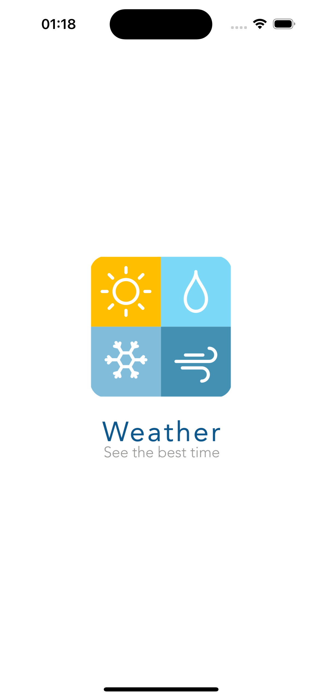
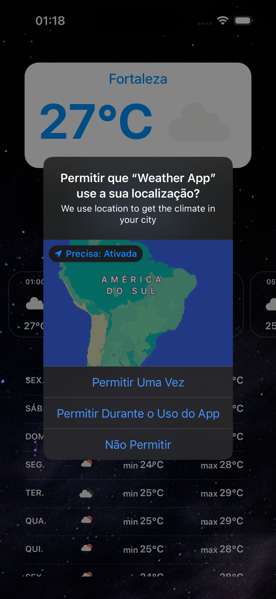
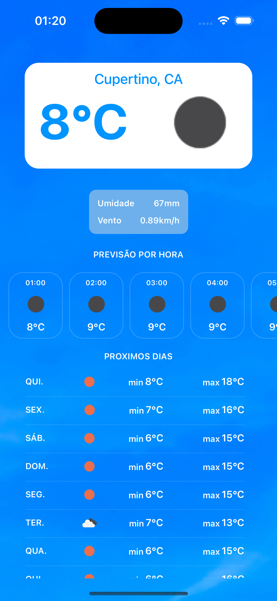
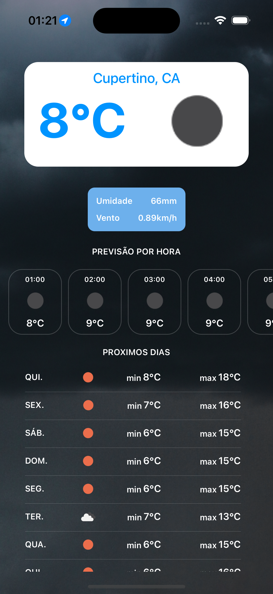

# weather-app-swift

Simple Weather App developed with Swift.

## Topics

- 🧑‍💻 MVVM-C
- 👽️ View Code
- 🎨 Animated Splash Screen
- 📍 User Location + Geocoding
- ☁ OpenWeather API integration
- 🔀 Dynamic background image
- 💄 Animated transition
- 🔒 Securely storing Api Keys
- ⚡️ Swift

## Screenshots

<div>





</div>

# How to use

Sign up in [Open Weather](https://openweathermap.org/api) and retrieve your api key.

1. Create `Weather App/Config.xcconfig` file with following struct

```
OPEN_WEATHER_API_KEY = YOUR_OPEN_WEATHER_API_KEY
```

2. Replace `YOUR_OPEN_WEATHER_API_KEY` with your own api key.

_obs: The key can take up to 20min to be activated._

#

You good to go!

# 🤓 + 💻 = 🚀
